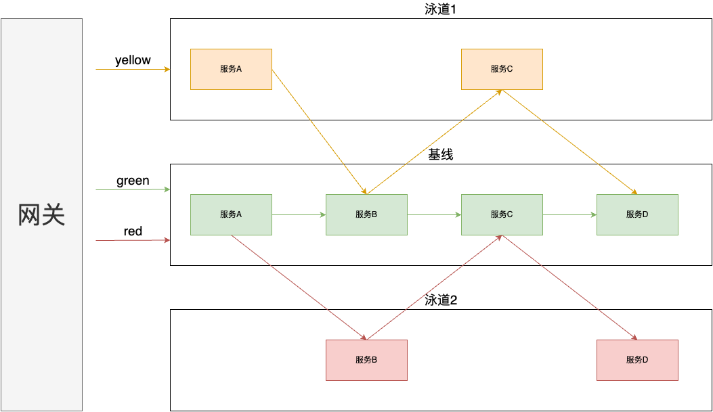

# zero-flow

[](https://github.com/chenquan/zero-flow/actions/workflows/go.yml)
[](https://github.com/chenquan/zero-flow/actions/workflows/codeql-analysis.yml)
[](https://codecov.io/gh/chenquan/zero-flow)

[](https://github.com/chenquan/zero-flow)
[](https://github.com/chenquan/zero-flow)
[](LICENSE)

> Implement flow staining in go-zero.



## install

```shell
go get github.com/chenquan/zero-flow
```

### rest

*user.yaml*

```yaml
Name: user
Host: 0.0.0.0
Port: 8888
HeaderTag: X-Zero-Flow-Tag

UserRpc:
  Etcd:
    Hosts:
      - 127.0.0.1:2379
    Key: user.rpc
Log:
  Level: debug
```

*config.go*

```go 
package config

import (
	"github.com/chenquan/zero-flow/rest"
	"github.com/chenquan/zero-flow/zrpc"
)

type Config struct {
	rest.RestConf
	UserRpc zrpc.RpcClientConf
}

```

```go
package main

import (
	"flag"
	"fmt"

	"github.com/chenquan/zero-flow/rest"
	"github.com/zeromicro/go-zero/core/logx"

	"github.com/zeromicro/go-zero/core/conf"
)

var configFile = flag.String("f", "etc/user.yaml", "the config file")

func main() {
	flag.Parse()

	var c config.Config
	conf.MustLoad(*configFile, &c)
	server := rest.MustNewServer(c.RestConf)
	defer server.Stop()

	ctx := svc.NewServiceContext(c)
	handler.RegisterHandlers(server, ctx)
	logx.DisableStat()
	fmt.Printf("Starting server at %s:%d...\n", c.Host, c.Port)
	server.Start()
}

```

### zrpc server

*user.yaml*

```yaml
Name: user.rpc
ListenOn: 0.0.0.0:8080
Etcd:
  Hosts:
    - 127.0.0.1:2379
  Key: user.rpc
Tag: red # 定义流量标签，相同流量标签的不同服务在一个调用链路中将构成一个泳道。
Log:
  Level: debug
```

*config.go*

```go
package config

import (
	"github.com/chenquan/zero-flow/zrpc"
)

type Config struct {
	zrpc.RpcServerConf
}
```

```go
package main

import (
	"flag"
	"fmt"

	"github.com/zeromicro/go-zero/core/logx"

	"github.com/chenquan/zero-flow/zrpc"
	"github.com/zeromicro/go-zero/core/conf"
	"github.com/zeromicro/go-zero/core/service"
	"google.golang.org/grpc"
	"google.golang.org/grpc/reflection"
)

var configFile = flag.String("f", "etc/user.yaml", "the config file")

func main() {
	flag.Parse()

	var c config.Config
	conf.MustLoad(*configFile, &c)
	ctx := svc.NewServiceContext(c)

	s := zrpc.MustNewServer(c.RpcServerConf, func(grpcServer *grpc.Server) {
		user.RegisterUserServer(grpcServer, server.NewUserServer(ctx))

		if c.Mode == service.DevMode || c.Mode == service.TestMode {
			reflection.Register(grpcServer)
		}
	})
	logx.DisableStat()
	defer s.Stop()
	fmt.Printf("Starting rpc server at %s...\n", c.ListenOn)
	s.Start()
}

```

<a href="https://www.buymeacoffee.com/chenquan"></a>
